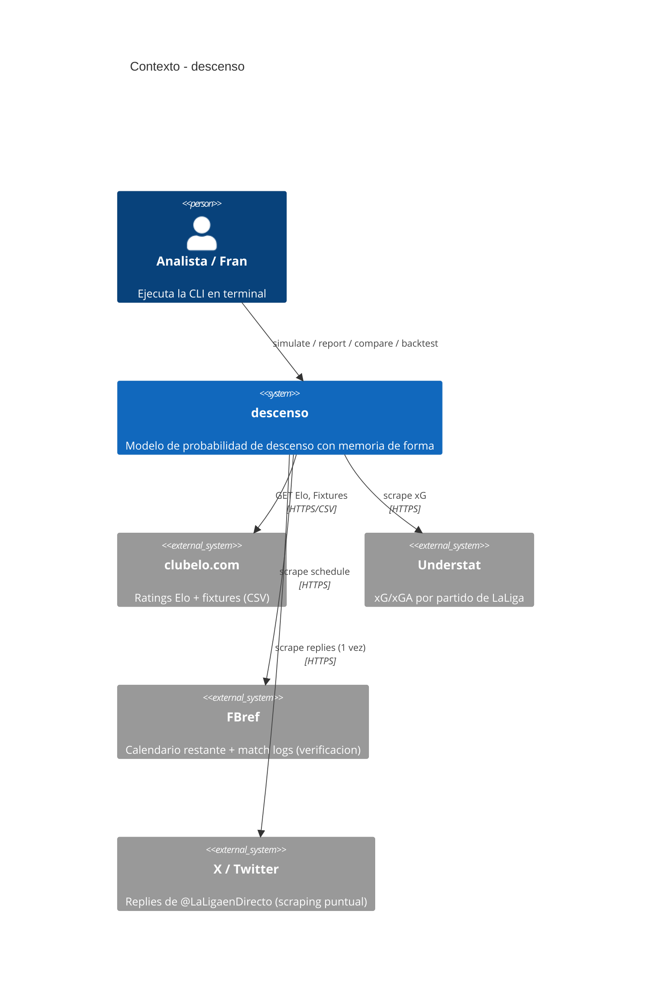
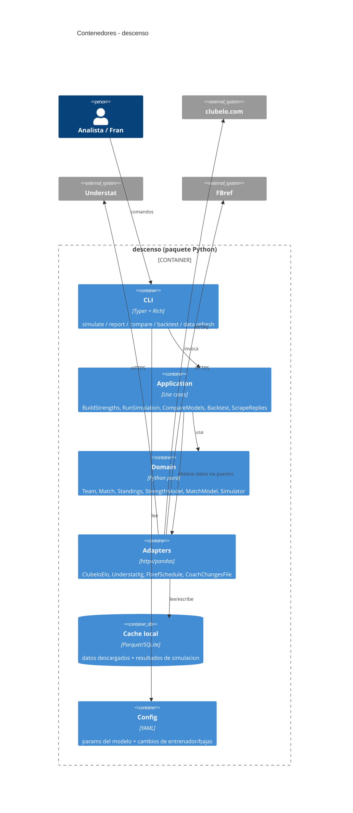
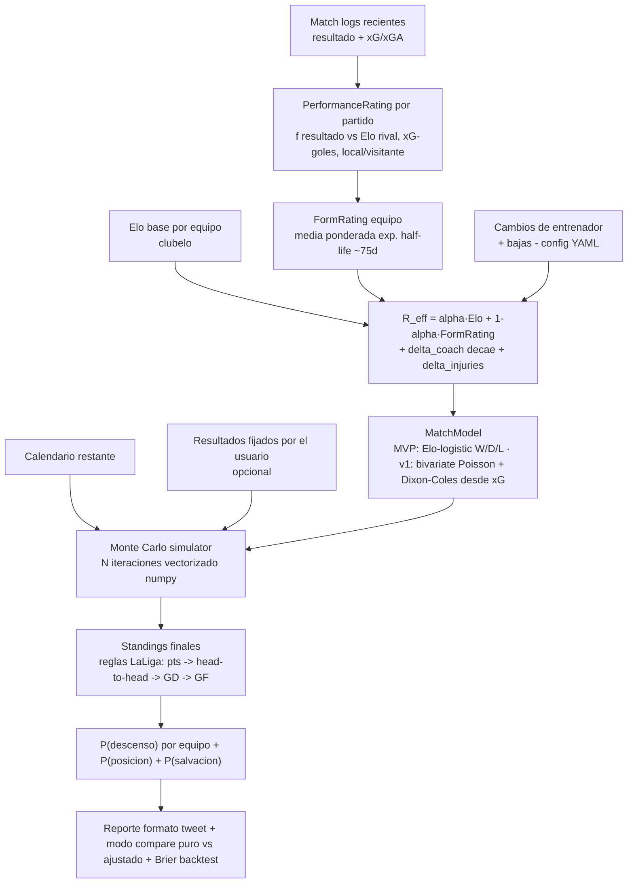

# Arquitectura — descenso (C4 + modelo)

# Arquitectura — `descenso`

CLI Python con arquitectura hexagonal ligera: `domain` puro, `adapters` para fuentes de datos externas, `application` con casos de uso, `cli` (Typer + Rich).

## C4 — Contexto



## C4 — Contenedores



## El modelo (componente clave) — "memoria de forma"



### Definición del modelo (matemática)

- **Elo base** `E_i`: último valor de clubelo.com para el equipo *i*.
- **Performance rating** de un partido jugado por *i* contra *j* (en J fecha *t*):
  - Resultado esperado Elo: `W_exp = 1 / (1 + 10^(-(E_i + h·local - E_j)/400))`.
  - Resultado ajustado por suerte: en lugar del marcador real, mezclar con el resultado "merecido" según xG: `goals_adj = β·goals_real + (1−β)·xG`. Convertir `(goals_adj_i − goals_adj_j)` a un resultado en [0,1] vía función logística suave.
  - `perf = K · (resultado_ajustado − W_exp)` → variación de rating implícita de ese partido.
- **Form rating** `F_i = E_i^{ref} + Σ_t w_t · perf_t / Σ_t w_t`, con `w_t = 0.5^((hoy − t)/half_life)`, `half_life ≈ 75 días` (≈ "los últimos 3 meses pesan; el inicio de temporada casi no").
- **Fuerza efectiva** `R_i = α·E_i + (1−α)·F_i + Δ_coach(i) + Δ_inj(i)`:
  - `α ≈ 0.5` (calibrable por backtest).
  - `Δ_coach`: bonus que decae tras un cambio de entrenador (p.ej. +25 Elo el 1er partido, decae a 0 en ~6 partidos) — efecto rebote documentado.
  - `Δ_inj`: ajuste manual opcional por bajas clave (config YAML).
- **Match model** para simular un partido pendiente *i* vs *j*:
  - **MVP**: `W/D/L` por Elo-logístico sobre `R_i − R_j + h`; muestrear margen de goles de una distribución calibrada (para tiebreakers de GD).
  - **v1**: fuerzas de ataque/defensa derivadas de `R` + xG histórico → **Poisson bivariada con corrección de Dixon-Coles** para marcadores bajos realistas.
- **Monte Carlo**: N iteraciones (default 100.000, vectorizado). Resultados fijados por el usuario se respetan; el resto se muestrea. Cada iteración → clasificación final con reglas LaLiga (puntos → puntos head-to-head entre empatados → diff. goles head-to-head → diff. goles general → goles a favor). Contar posiciones de descenso (bottom 3). Agregar → `P(descenso)_i`.
- **Validación**: backtest sobre 2022-23, 2023-24, 2024-25; en cada jornada predecir y comparar con la realidad. Métricas: **Brier score** y **log-loss**. Comparar modelo puro (`α=1`, sin form, sin bumps) vs. ajustado. Este número es la prueba empírica de que la "memoria de forma" mejora — la respuesta directa a la crítica de adrirbb.

## Stack

Python 3.11+ · `typer` (CLI) · `rich` (progreso/tablas; el ranking final se imprime en texto plano copiable) · `httpx` (fetch) · `pandas` (data wrangling) · `numpy` (Monte Carlo vectorizado) · `scipy` (Poisson/Dixon-Coles) · `pydantic` v2 (config y modelos de dominio) · `pytest` + `pytest-cov` · `ruff` + `black` · `mypy --strict`. Cache: ficheros Parquet en `data/cache/` (+ SQLite opcional). Scraping puntual de X: `scripts/scrape_replies.py` intenta `snscrape`/lectura web y, si falla (frágil), pide pegar los replies en `data/replies.txt`.

## Estructura de directorios

```
descenso/
  pyproject.toml
  README.md  CLAUDE.md
  config.yaml                 # params del modelo
  data/
    coach_changes.yaml        # cambios de entrenador + bumps + bajas (seed manual)
    cache/                    # parquet de datos descargados y simulaciones (gitignored)
    replies.txt               # input del scraping puntual de X (gitignored)
  src/descenso/
    domain/                   # Team, Match, Standings, StrengthModel, MatchModel, Simulator, tiebreakers
    application/              # build_strengths, run_simulation, compare_models, backtest, scrape_replies
    adapters/
      data/                   # clubelo_elo.py, understat_xg.py, fbref_schedule.py, coach_changes_file.py, cache.py
    cli/                      # app.py (Typer): simulate, report, compare, backtest, data
    config.py                 # carga/validación de config.yaml
  scripts/scrape_replies.py   # uso único: investigación de requisitos en X
  tests/                      # unit (domain) + integration (adapters con datos reales cacheados) + e2e (CLI)
  .github/workflows/ci.yml
```

## Nota sobre "Fase 2 visual"

Al ser una herramienta de **terminal** (no app web/móvil), los sub-pasos de design system visual (paleta, tipografía, iconografía, wireframes en Pencil/Stitch, mapa de navegación en Excalidraw) no aplican. El "artefacto visual" equivalente es: (a) los diagramas C4/flow de arriba, (b) el mockup ASCII de la sesión de terminal (ver `concepts/cli-ux`). Iconografía: solo texto/box-drawing, **sin emojis** (regla APEX). Salida del ranking en texto plano para que sea pegable en un tweet.
