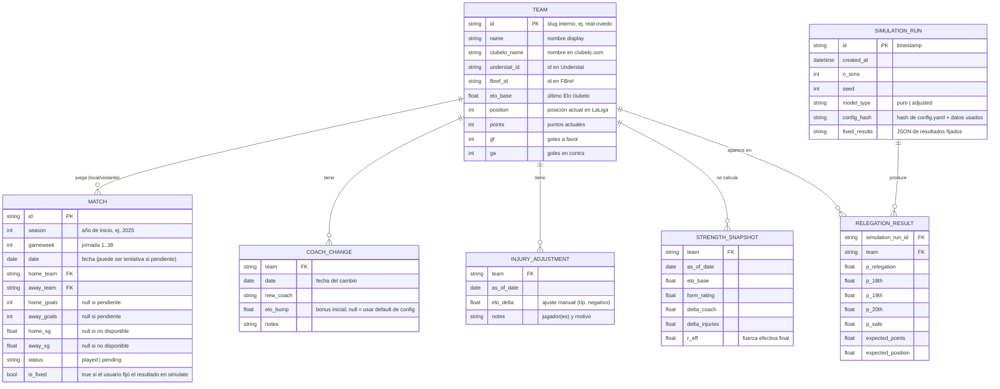

# Modelo de datos — descenso

# Modelo de datos — `descenso`

No hay base de datos relacional: los datos viven en memoria (pydantic) y se cachean en **Parquet** bajo `data/cache/`. El "esquema" es el de esos dataframes/objetos.

## Ficheros de configuración (no en DB)

- `config.yaml`: `alpha` (blend Elo/forma), `form_half_life_days` (≈75), `home_advantage` (Elo points), `coach_bump_default` y `coach_bump_decay_matches`, `xg_blend_beta` (peso goles vs xG en el performance rating), `n_sims` default, `model_type` default, rutas de cache.
- `data/coach_changes.yaml`: lista seed de cambios de entrenador de la temporada actual + ajustes de bajas. Editable por colaboradores; es la pieza "humana/verificable" del modelo.
